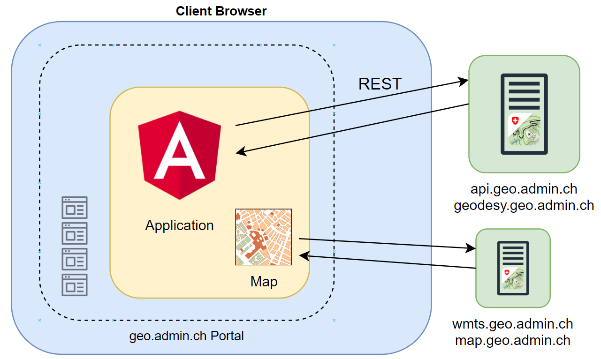
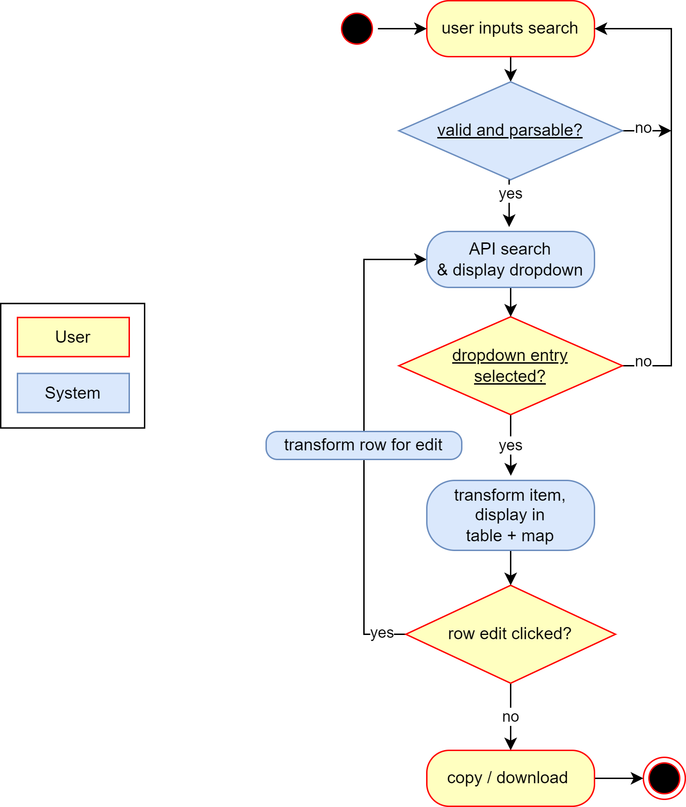

# Technical Documentation
This document gives a technical overview of the application and also shows how to run and develop it.

## Application

### Angular
The application is a standard, single-page [Angular](https://angular.io) application. It uses [TypeScript](https://www.typescriptlang.org) for having type-safety with javascript and [SCSS](https://sass-lang.com) for styling.

### Oblique framework
Since this project could end up beeing integrated by the swiss government, it uses [Oblique](https://oblique.bit.admin.ch/oblique) ([GitHub](https://github.com/oblique-bit/oblique)), which is a Material-based framework for swiss branded applications. It is developed by the Federal Office of Information Technology, Systems and Telecommunication [FOITT](https://bit.admin.ch).

It does more than just provide components, since it also handles the site layout and provides many handy services, e.g. for notifications or intercepting backend calls etc.

### Build & Hosting (Netlify)
During development, there was the need be able to quickly deploy and use our application online. We use [Netlify](https://www.netlify.com/) for that purpose. However, there is no Netlify-specific functionality and the application can be built and hosted elsewhere. The current setup pulls the changes from the repository, builds the Angular application on Netlify and publishes the site on its CDN. This allows us to move fast but still have the advantages of a dedicated build environment.

[](https://app.netlify.com/sites/swisstopo-showcases/deploys)

### Structure
The folder structure is based on the use cases. For now, this is only `address-to-coordinate`. Besides that, there is only the Guide/Cookbook component that has its own folder.

```
+-- src
    +-- app
	    +-- address-to-coordinate
			+-- components/
			+-- services/
			+-- models/
		+-- guide/

	+-- assets/
	+-- styles/
```

As soon as new functionalities are implemented, the structure has to be reconsidered because most services, models and components can most likely be used globally across multiple use cases.

### Guide / Cookbook
The user guide is available in the repository ([Link](../src/assets/cookbook/cookbook-en.md)) but also in the application itself, where the markdown gets rendered directly inside. This functionality is implemented with [ngx-markdown](https://github.com/jfcere/ngx-markdown). It does its job very well, but it is quiet an overkill for our needs since we don't need dynamic rendering as the content does not change. A better way would be to implement a build step that converts the markdown into markup that gets directly injected to our app.

### Internationalization
Oblique uses [ngx-translate](https://github.com/ngx-translate/core).
Our site is multilingual because there are four main languages in Switzerland. Therefore it should be possible to change the languages. The following languages are supported:

- Deutsch, German, Allemand, Tedesco, Romanisch
- Français, Französisch, French, Francese, Roman
- Italiano, Italienisch, Italian, Italien, Romanico
- Bündnerromanisch, Tudestg, Talian, Franzos, Engles
- English, Englisch, Anglais, Inglese, Romance

The language bindings can be found **[here](../application/src/assets/i18n)**.

### Map
The map is implemented with [OpenLayers](https://openlayers.org/), a widely popular mapping library.

### Coordinate systems
There are currently three cordinate systems supported. The search results already contain the WGS84 (GPS) coordinates which then get converted to the swiss systems.

| Coordinate system |
|-------------------|
| WGS84 / GPS       |
| CH1903+ / LV95    |
| CH1903 / LV03     |

#### Consumed APIs / Services
For every geo-related functionality in the application, an API from [`geo.admin.ch`](https://geo.admin.ch) is used. Since their APIs have a fair-use policy, there is no need for authentication of tokens at all.

| Service                      | Usage                     | Params                                     | Example |
|------------------------------|---------------------------|--------------------------------------------|---------|
| api.geo.admin.ch             | Address search            | Search text and                              | `https://api3.geo.admin.ch/rest/services/api/SearchServer?lang=de&searchText=Mattenstrasse%2018&=locations&origins=address` |
| geodesy.geo.admin.ch         | Coordinate conversions    | Wgs84 coordinates -> LV95 / LV03 coordinates                                           | `https://geodesy.geo.admin.ch/reframe/wgs84tolv95?northing=46.92793655395508&easting=7.451352119445801&format=json` |
| wmts.geo.admin.ch            | Map tiles                 | X-Y-Z positions and layer (`ch.swisstopo.pixelkarte-farbe` or `ch.swisstopo.swissimage`)                                           | `https://wmts.geo.admin.ch/1.0.0/ch.swisstopo.pixelkarte-farbe/default/current/3857/15/17061/11536.jpeg` |
| map.geo.admin.ch             | Pin icon, and link to map | None - .kml will be uploaded by the user | `https://map.geo.admin.ch/f13b978/img/marker.png` |

<hr>

## Start and develop
To start the application, run `npm install` in this directory and then run `ng serve`.

### Angular CLI version
This project was generated with [Angular CLI](https://github.com/angular/angular-cli) version 12.2.13. Mostly because Oblique was not yet available for Angular 13 at the time of creation.

### Development server
Run `ng serve` for a dev server. Navigate to `http://localhost:4200/`. The app will automatically reload if you change any of the source files.

### Code scaffolding
Run `ng generate component component-name` to generate a new component. You can also use `ng generate directive|pipe|service|class|guard|interface|enum|module`.

### Build
Run `ng build` to build the project. The build artifacts will be stored in the `dist/` directory.

### Running unit tests
Run `ng test` to execute the unit tests via [Karma](https://karma-runner.github.io). However, we don't have any automated tests at the moment.

<hr>

## System boundaries


This shows the system at a very high level, with the application and the consumed APIs. The dotted line indicates the official [geo.admin.ch](https://geo.admin.ch) portal, where the functionality is planned to be integrated. But for now, it is a standalone frontend application.

## Activity Diagram


This picture shows a high-level diagram of how the user interacts with the application.
