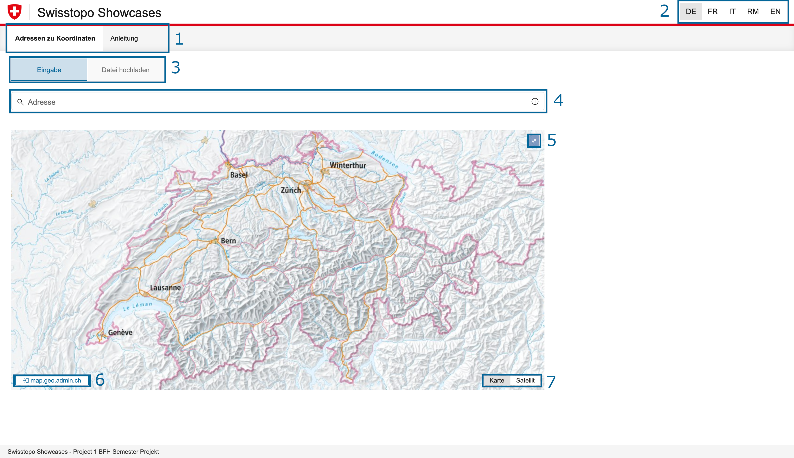
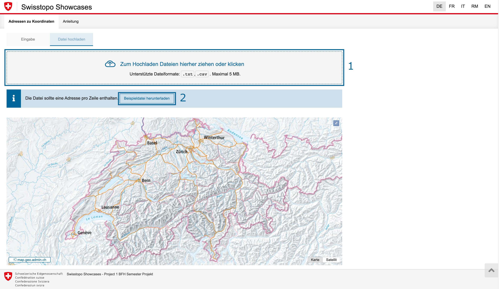
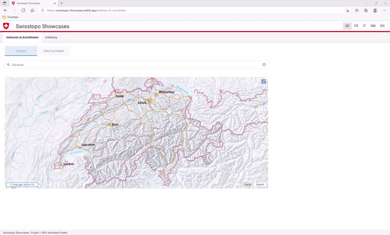
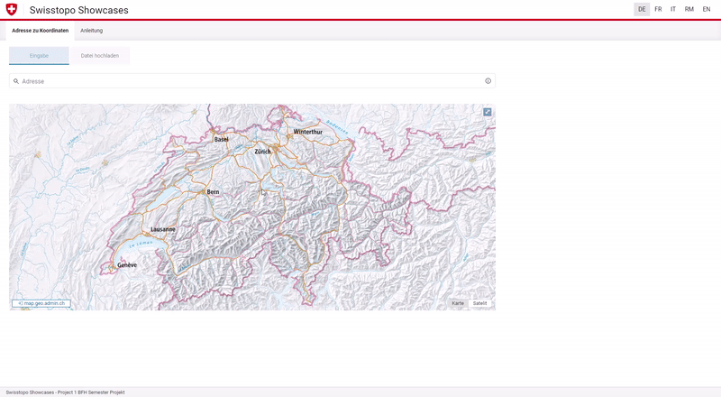
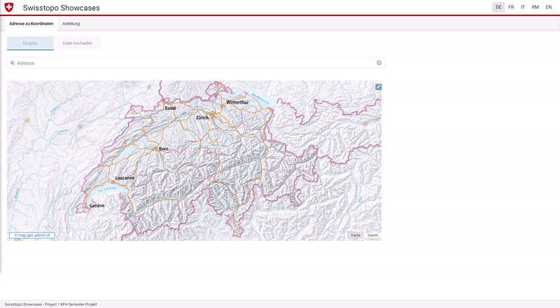

# Cookbook
> Diese Anleitung deckt die Funktionen der Protoyp-Version ab und ist deswegen nicht mehr aktuell.

Willkommen auf dem Cookbook. Hier finden Sie verschiedenen Informationen und Erklärungen zu den einzelnen Funktionen von Swisstopo.

## Übersicht

Nachfolgend finden Sie drei Bilder der Webseite, welche jeweils mit verschiedenen Nummern bestückt ist. Unterhalb der Abbildungen finden Sie die entsprechenden Erklärungen der Elemente.

### Startseite

| Nummer in der Abbildung | Beschreibung                                                                                                                                                                                                                                                                                                                                                                                 |
| ----------------------- | -------------------------------------------------------------------------------------------------------------------------------------------------------------------------------------------------------------------------------------------------------------------------------------------------------------------------------------------------------------------------------------------- |
| 1                       | Hier können Sie zwischen der Applikation und der Anleitung hin und her wechseln.                                                                                                                                                                                                                                                                                                             |
| 2                       | Hier können Sie Sprache wechseln. Folgende Sprachen können ausgewählt werden: <ul><li> DE - Deutsch </li><li> FR - Français </li><li> IT - Italiano </li><li> RM - Romontsch </li><li> EN - English </li></ul>                                                                                                                                                                               |
| 3                       | Hier können Sie zwischen den beiden Fukntionen "Eingabe" und Datei hochladen hin und her Wechseln.Die Eigabe erlaubt eine einzelne Adresse/mehrere Adressen. Sie können unter "Datei hochladen" eine Datei hochladen und die Informationen darstellen. Es kann eine Referenzdatei als Beispiel heruntergeladen werden. Sie finden die Beschreibung im dritten Bild unterhalb dieser Tabelle. |
| 4                       | Das ist ein Suchfeld in welchem Sie eine Adresse oder mehrere Adressen eingeben können. Sobald Sie eine Adresse tippen, wird Ihnen die Website Vorschläge machen, welche Sie auswählen können.                                                                                                                                                                                               |
| 5                       | Hier können Sie die Karte als Full-Screen darstellen.                                                                                                                                                                                                                                                                                                                                        |
| 6                       | Sie gelangen durch diesen Knopf auf die Website von geo.admin.ch.                                                                                                                                                                                                                                                                                                                            |
| 7                       | Sie können hier zwischen der einfachen Karte und dem Satelit hin und her wechseln.                                                                                                                                                                                                                                                                                                           |

 

### Webseite nach Suche

| Nummer in der Abbildung | Beschreibung                                                                                      |
| ----------------------- | ------------------------------------------------------------------------------------------------- |
| 1                       | Die Suchergebnisse können hier zurückgesetzt werden.                                              |
| 2                       | Einzelne Suchergebnisse können hier gelöscht werden.                                              |
| 3                       | Einzelne Suchergebnisse können hier abgeändert werden.                                            |
| 4                       | Durch diesen Knopf können Sie die Suchergebnisse (komplette Tabelle) kopieren.                    |
| 5                       | Durch diesen Knopf können Sie die Suchergebnisse (komplette Tabelle) herunterladen in eine Datei. |
| 6                       | Durch diesen Knopf können Sie die Koordinatendarstellung ändern.                                  |

### Datei hochladen

| Nummer in der Abbildung | Beschreibung                                                                                                                                                          |
| ----------------------- | --------------------------------------------------------------------------------------------------------------------------------------------------------------------- |
| 1                       | Sie können hier mittels Drag & Drop oder Dateiauswahl eine Datei hochladen und entsprechend anzeigen lassen auf der Karte. Sie finden eine Beispieldatei in Nummer 2. |
| 2                       | Sie können durch das Klicken des Buttons eine Beispielhochladedatei herunterladen und dieses mit Ihren Werten hochladen.                                              |

## Anleitungen

Im nachfolgenden Abschnitt werden die einzelnen Funktionen Schritt für Schritt erklärt. Sie können diese als geführte Handhabung nutzen, um die Webseite optimals zu verwenden.

### Addresse suchen

### Adresse löschen

### Angaben bearbeiten

### Suchergebnisse in Datei speichern & anzeigen

### Datei hochladen

### Fehler erkennen und lösen

