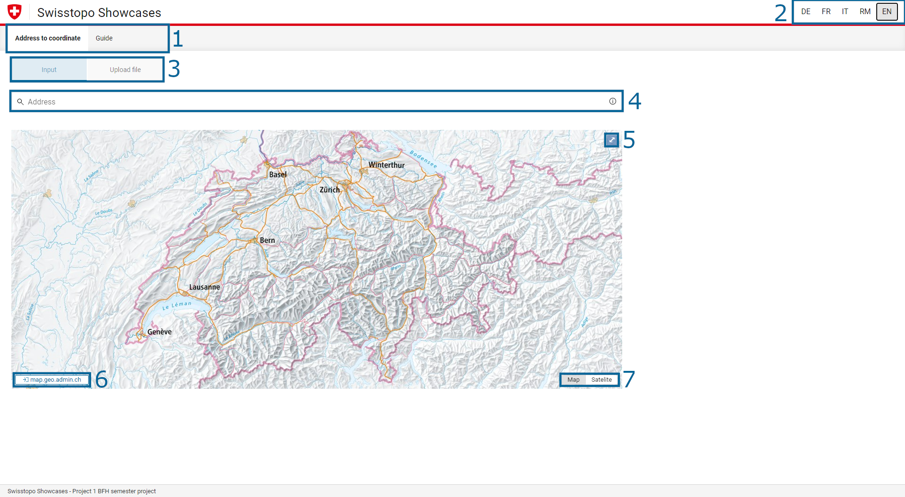
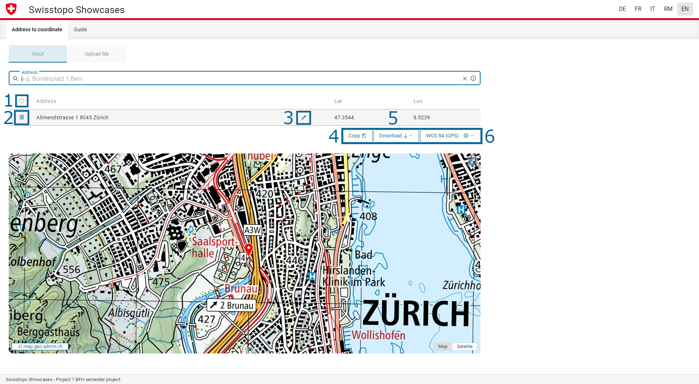
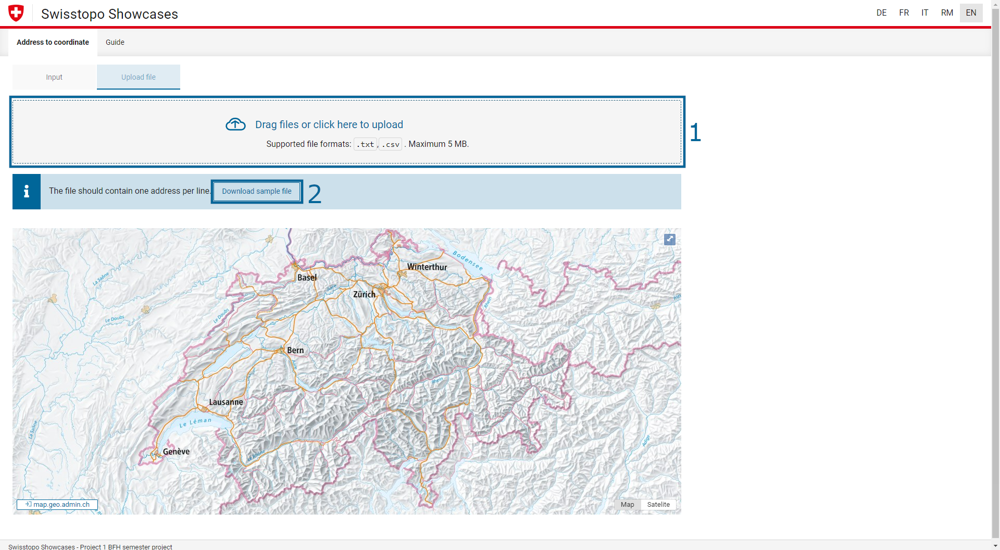
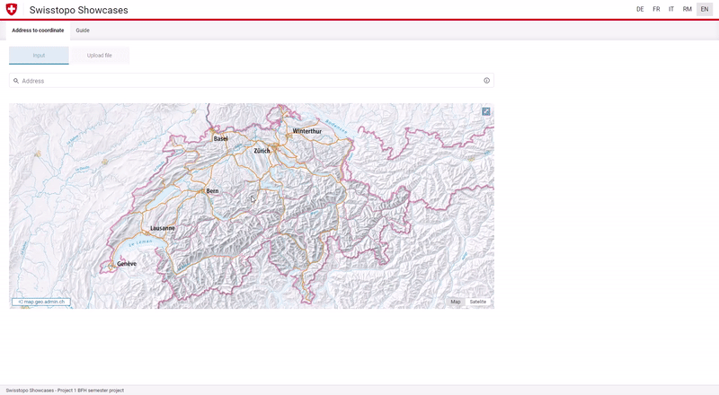
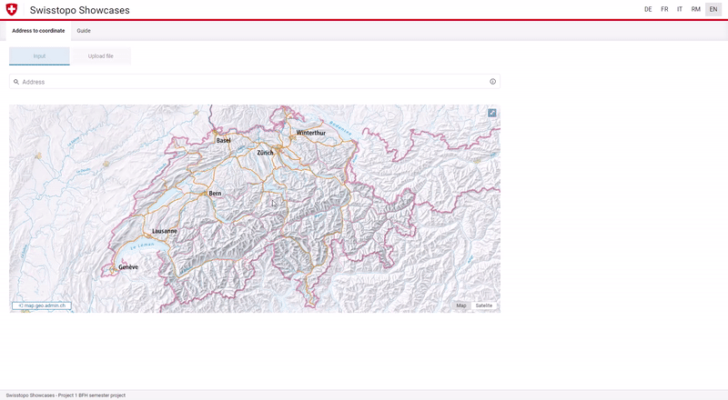
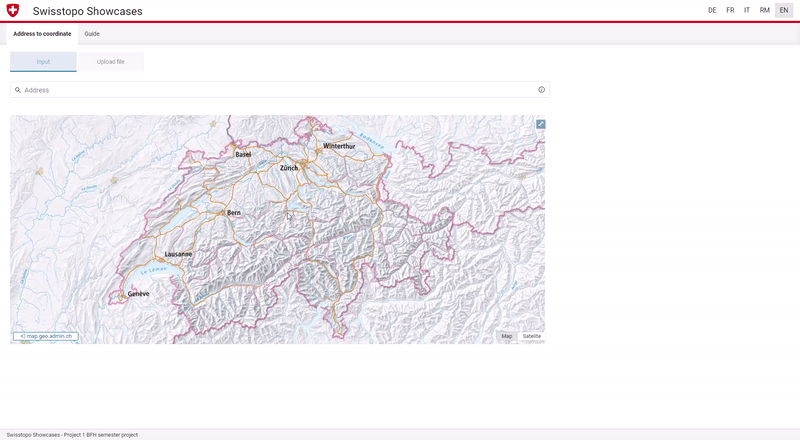

# Cookbook

Welcome to the Cookbook. Here you will find various information and explanations on the individual functions of Swisstopo.

## Overview

Below you will find three images of the website, each with different numbers. Below the images you will find the corresponding explanations of the elements.

### Homepage

| Number in the illustration | Description                                                                                                                                                                                                                                                                                                                                                                                 |
| ----------------------- | -------------------------------------------------------------------------------------------------------------------------------------------------------------------------------------------------------------------------------------------------------------------------------------------------------------------------------------------------------------------------------------------- |
| 1                       | Here you can switch back and forth between the application and the instructions.                                                                                                                                                                                                                                                                                                             |
| 2                       | Here you can change the language. The following languages can be selected: <ul><li> DE - German </li><li> FR - French </li><li> IT - Italian </li><li> RM - Romansh </li><li> EN - English </li></ul>                                                                                                                                                                               |
| 3                       | Here you can switch back and forth between the two functions "Input" and "Upload file". The input allows a single address/multiple addresses. You can upload a file under "Upload file" and display the information. A reference file can be downloaded as an example. You will find the description in the third image below this table. |
| 4                       | This is a search field in which you can enter one or more addresses. As soon as you type an address, the website will give you suggestions which you can choose.                                                                                                                                                                                               |
| 5                       | Here you can display the map as a full screen.                                                                                                                                                                                                                                                                                                                                        |
| 6                       | This button takes you to the geo.admin.ch website geo.admin.ch                                                                                                                                                                                                                                                                                                                            |
| 7                       | You can switch back and forth between the simple map and the satelite here.                                                                                                                                                                                                                                                                                                           |

 

### Website by search

| Number in the illustration | Description                                                                                       |
| ----------------------- | ------------------------------------------------------------------------------------------------- |
| 1                       | The search results can be reset here.                                              |
| 2                       | Individual search results can be deleted here.                                              |
| 3                       | Individual search results can be changed here.                                            |
| 4                       | Through this button you can copy the search results (complete table).                    |
| 5                       | Through this button you can download the search results (complete table) to a file. |
| 6                       | This button allows you to change the coordinate display.                                  |

### Upload file

| Number in the illustration | Description                                                                                                        |
| ----------------------- | --------------------------------------------------------------------------------------------------------------------------------------------------------------------- |
| 1                       | You can upload a file here using drag & drop or file selection and have it displayed accordingly on the map. You will find an example file in number 2. |
| 2                       | You can download a sample upload file by clicking the button and upload it with your values.                                              |

## Guide

In the following section, the individual functions are explained step by step. You can use this as a guided handling to use the website optimally.

### Search address

### Delete address

### Edit address

### Save & display search results in file

### Upload file

### Recognise and solve errors

