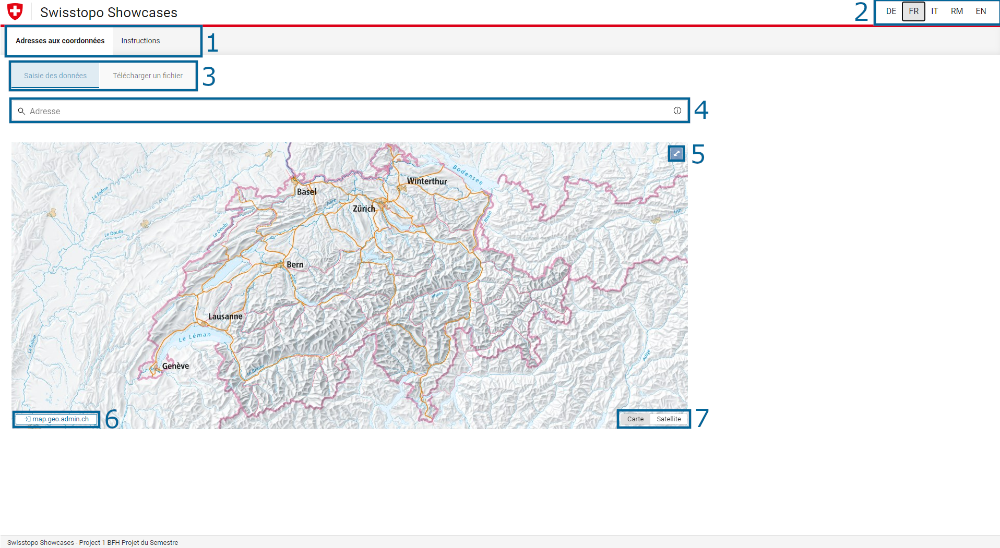
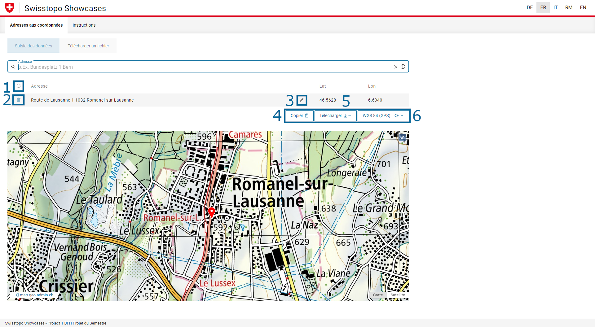
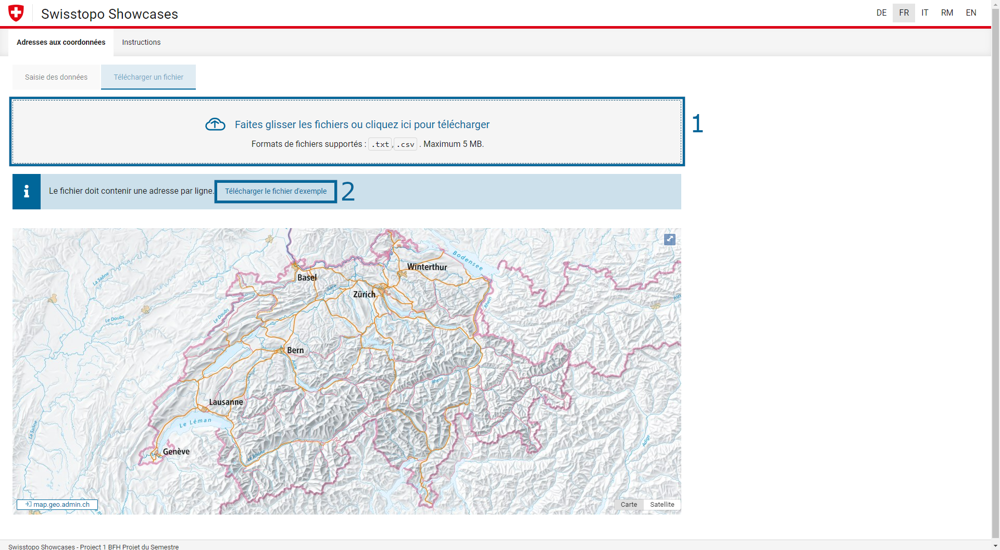
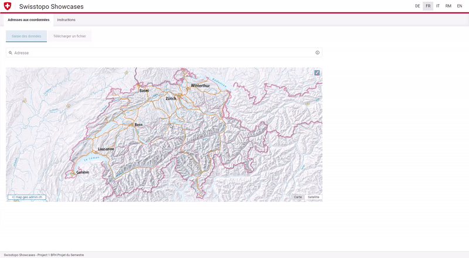
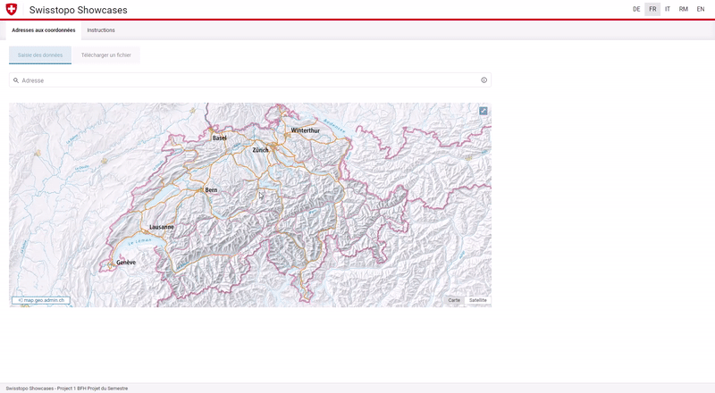
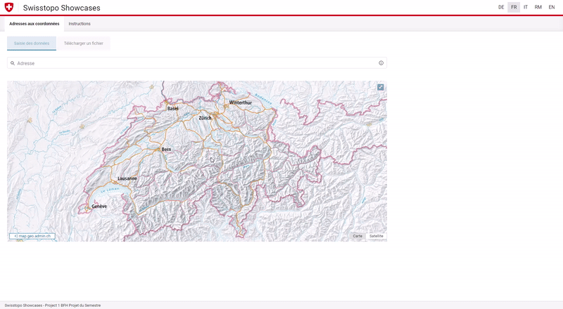
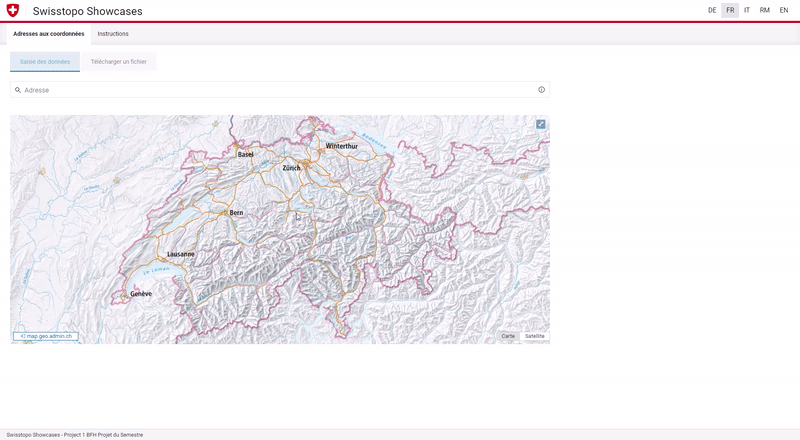
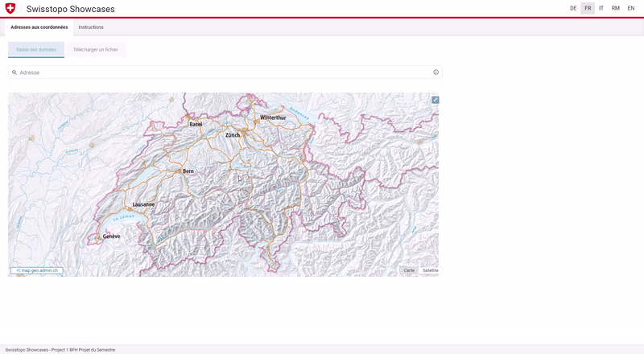

# Cookbook

Bienvenue sur le Cookbook. Vous y trouverez des informations et des explications sur les différentes fonctions de Swisstopo.

## Aperçu

Ci-dessous, vous trouverez trois images du site web, chacune avec des numéros différents. En dessous des illustrations, vous trouverez les explications correspondantes aux éléments.

### Page d'accueil

| Numéro dans l'illustration | Description                                                                                                                                                                                                                                                                                                                                                                                 |
| ----------------------- | -------------------------------------------------------------------------------------------------------------------------------------------------------------------------------------------------------------------------------------------------------------------------------------------------------------------------------------------------------------------------------------------- |
| 1                       | Vous pouvez passer de l'application au guide.                                                                                                                                                                                                                                                                                                             |
| 2                       | Vous pouvez changer de langue. Les langues suivantes peuvent être sélectionnées : <ul><li> DE - Allemand </li><li> FR - Français </li><li> IT - Italien </li><li> RM - Romontsch </li><li> EN - Anglais </li></ul>                                                                                                                                                                               |
| 3                       | Vous pouvez basculer entre les deux fonctions "Saisie" et "Télécharger le fichier". La saisie permet une seule adresse/plusieurs adresses. Sous "Télécharger un fichier", vous pouvez télécharger un fichier et afficher les informations. Un fichier de référence peut être téléchargé à titre d'exemple. Vous trouverez la description dans le troisième écran en dessous de ce tableau. |
| 4                       | Il s'agit d'un champ de recherche dans lequel vous pouvez saisir une ou plusieurs adresses. Dès que vous tapez une adresse, le site vous fait des propositions que vous pouvez choisir.                                                                                                                                                                                               |
| 5                       | Vous pouvez afficher la carte en plein écran.                                                                                                                                                                                                                                                                                                                                         |
| 6                       | En cliquant sur ce bouton, vous accédez au site geo.admin.ch.                                                                                                                                                                                                                                                                                                                            |
| 7                       | Vous pouvez passer de la carte simple à la carte satellite.                                                                                                                                                                                                                                                                                                           |

 

### Page web par recherche

| Numéro dans l'illustration | Description                                                                                      |
| ----------------------- | ------------------------------------------------------------------------------------------------- |
| 1                       | Les résultats de la recherche peuvent être réinitialisés.                                     |
| 2                       | Les résultats de recherches individuels peuvent être supprimés.                                |
| 3                       | Les résultats de recherches individuels peuvent être modifiés.                                 |
| 4                       | Ce bouton permet de copier les résultats de la recherche (tableau complet).               |
| 5                       | En cliquant sur ce bouton, vous pouvez télécharger les résultats de la recherche (tableau complet) dans un fichier. |
| 6                       | Ce bouton permet de modifier l'affichage des coordonnées.                                  |

### Télécharger le fichier

| Numéro dans l'illustration | Description                                                                                                                                                           |
| ----------------------- | --------------------------------------------------------------------------------------------------------------------------------------------------------------------- |
| 1                       | Vous pouvez télécharger, à cet endroit un fichier en utilisant "glisser-déposer" ou par sélection de fichier et l'afficher en conséquence sur la carte. Vous le retrouverez au point 2.  |
| 2                       | Vous pouvez télécharger un exemple de fichier en cliquant sur le bouton. Il pourra ensuite être exporté selon vos valeurs.    |

## Instructions

Dans la section suivante, les différentes fonctions sont expliquées étape par étape. Vous pouvez les utiliser comme une manipulation guidée afin d'utiliser le site de manière optimale.

### Chercher une adresse

### Supprimer l'adresse

### Modifier les données

### Enregistrer et afficher les résultats de la recherche dans un fichier

### Télécharger le fichier

### Identifier et résoudre les erreurs

