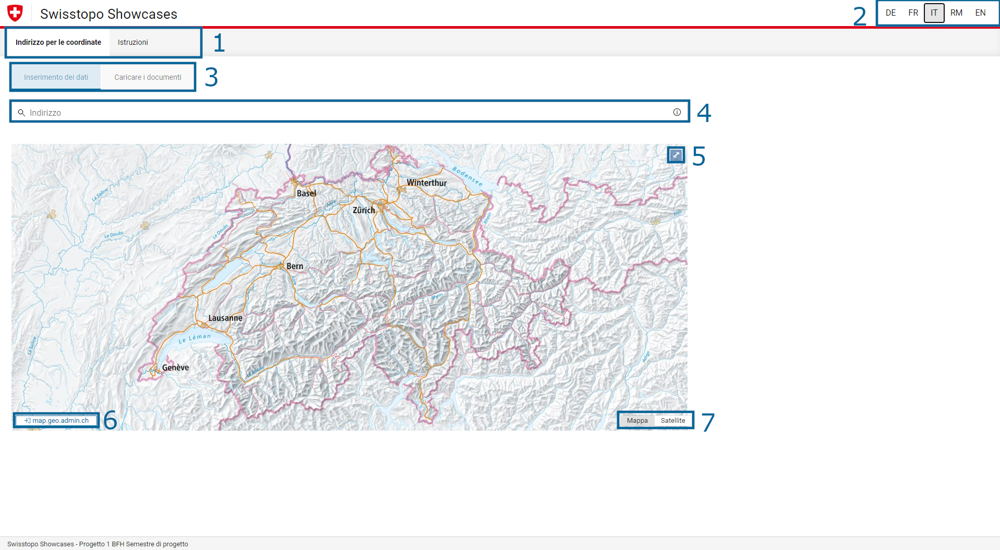

# Cookbook
> Questo manuale copre le funzioni della versione prototipo e non è quindi più aggiornato.

Benvenuti nel Cookbook. Qui si trovano le informazioni e le spiegazioni sulle singole funzioni di Swisstopo.

## Panoramica

Nel sito web si trovano tre immagini correlate, ognuna con il proprio numero. Le spiegazioni corrispondenti agli elementi si trovano sotto le immagini.

### Pagina iniziale

| Numero nell’immagine | Descrizione                                                                                                                                                                                                                                                                                                                                                                                 |
| ----------------------- | -------------------------------------------------------------------------------------------------------------------------------------------------------------------------------------------------------------------------------------------------------------------------------------------------------------------------------------------------------------------------------------------- |
| 1                       | Qui si può passare dall’applicazione alle istruzioni e vice versa.                                                                                                                                                                                                                                                                                                            |
| 2                       | 	Qui è possibile selezionare e scegliere la lingua desiderata: <ul><li> DE - Tedesco </li><li> FR - Francese </li><li> IT - Italiano </li><li> RM - Romancio </li><li> EN - Inglese </li></ul>                                                                                                                                                                               |
| 3                       | 	Qui si può “registrare” e “caricare” i dati, queste due funzioni possono essere cambiate a seconda dell’esigenza. La registrazione permette uno o più indirizzi. Alla voce “caricare” è possibile caricare un documento e visualizzare le informazioni. Un documento di riferimento può essere scaricato come esempio. Trovate la descrizione nella terza immagine sotto questa tabella. |
| 4                       | Questo è un campo di ricerca in cui è possibile inserire uno o più indirizzi. Digitando un indirizzo, la pagina web proporrà diverse proposte che possono essere scelte individualmente.                                                                                                                                                                                              |
| 5                       | 	LLa mappa viene visualizzata su tutto lo schermo.                                                                                                                                                                                                                                                                                                                                        |
| 6                       | 	Questo pulsante conduce al sito web geo.admin.ch.                                                                                                                                                                                                                                                                                                                           |
| 7                       | 	Qui si può passare dalla carta topografica a quella satellitare.                                                                                                                                                                                                                                                                                                          |

 

### Sito web di ricerca

| Numero nell’immagine | Descrizione                                                                                      |
| ----------------------- | ------------------------------------------------------------------------------------------------- |
| 1                       | 	Si possono reimpostare i risultati della ricerca.                                             |
| 2                       | 	Si possono cancellare i risultati della ricerca individuale.                                             |
| 3                       | 	Si possono cambiare i risultati della ricerca individuale.                                           |
| 4                       | 	Cliccando su questo pulsante è possibile copiare i risultati della ricerca (tabella completa).                    |
| 5                       | 	Cliccando su questo pulsante è possibile scaricare i risultati della ricerca (tabella completa) in un documento. |
| 6                       | 	Questo pulsante permette di cambiare la visualizzazione delle coordinate.                                  |

### Caricare i documenti

| Numero nell’immagine | DEscrizione                                                                                                                                                          |
| ----------------------- | --------------------------------------------------------------------------------------------------------------------------------------------------------------------- |
| 1                       | 	Tramite “Drag & Drop” oppure “scelta documento” può essere caricato un documento e contemporaneamente visualizzarlo sulla carta topografica. Un esempio si trova al punto 2. |
| 2                       | 	Cliccando sul bottone si scarica un esempio di “documento caricato” e questo documento caricarlo con i propri dati.                                              |

## Istruzioni

Nel seguente paragrafo, vengono spiegate le singole funzioni. Può essere usato come guida per l’utilizzo del sito web in modo ottimale.

### Cercare l’indirizzo

### Cancellare l’indirizzo

### Modificare i dettagli

###  Salvare e visualizzare i risultati della ricerca in un documento

### Caricare il documento

### Riconoscere e risolvere gli errori

